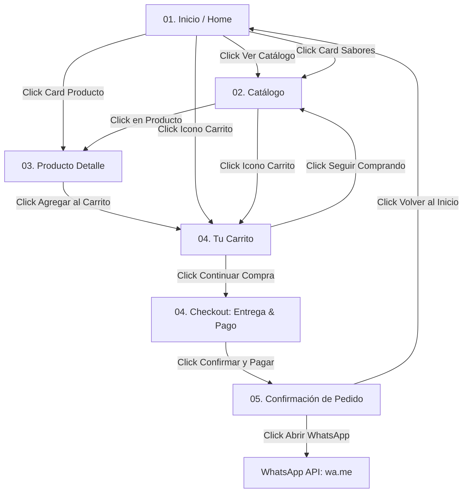

# GUÍA MAESTRA DE PROTOTIPADO NAVEGABLE EN FIGMA
## Proyecto: E-Commerce Elite "Cerro & Mar - Alfajores de Autor"
### Especificación Técnica de Wireframes UX/UI (01 a 05) y Flujo Operativo

Esta guía detalla la arquitectura completa para armar el prototipo interactivo en **Figma** reproduciendo exactamente la estética, grilla y navegación de los wireframes oficiales del proyecto.

---

## 1. SISTEMA DE DISEÑO (DESIGN TOKENS EN FIGMA)

### 🎨 Paleta de Colores (Color Variables)
- **`Fondo General / Canvas`**: `#EDE7DD` (Tono crema suave artesanal patagónico)
- **`Superficies de Cards / Modales`**: `#FFFFFF` / `#F7F4EE`
- **`Títulos, Botones y Acentos`**: `#004F68` (Azul profundo patagónico)
- **`Hover y Fondos Dark`**: `#003647`
- **`Dorado Artesanal`**: `#C6923C`
- **`WhatsApp & Éxito`**: `#25D366` / `#2E7D32`
- **`Textos de Lectura`**: `#1E293B`
- **`Textos Secundarios`**: `#5A6A7A`
- **`Bordes y Líneas`**: `rgba(0, 79, 104, 0.14)`

### 🔤 Tipografía (Google Fonts - Montserrat)
- **Logo Monograma**: Montserrat Black / Bold Italic (`C&M`)
- **Títulos Principales / H1**: Montserrat Bold (800) · 42px / 48px
- **Títulos de Sección / H2**: Montserrat Bold (800) · 28px / 34px
- **Nombres de Producto / H3**: Montserrat Bold (800) · 18px / 24px
- **Precios**: Montserrat Bold (800) · 20px / 24px
- **Cuerpo y Descripciones**: Montserrat Medium (500) · 14px / 22px
- **Botones y Badges**: Montserrat Bold (700) · 13px / 16px

---

## 2. ARQUITECTURA DE LAS 5 PANTALLAS / WIREFRAMES (PAGE MAP)

---

### 🖥️ ESPECIFICACIÓN DETALLADA DE CADA PANTALLA

#### 📄 01. INICIO (Home Screen - 1440px)
- **Header:** Monograma circular `C&M`, logotipo tipográfico `CERRO & MAR`, enlaces de navegación (`Inicio`, `Catálogo`, `Línea Premium`, `Nosotros`, `Contacto`) y acciones (`Buscador`, `Mi Cuenta`, `Armar Caja`, `Carrito con badge`).
- **Hero Banner:**
  - Título: *"Alfajores que nacen de nuestra tierra."*
  - Subtítulo: *"Sabores patagónicos, artesanales y con identidad propia."*
  - Botón: `Ver catálogo ->` (Fondo `#004F68`, Texto `#EDE7DD`).
  - Columna derecha: Tarjeta artística con ilustración topográfica y producto destacado.
- **Sección "Nuestros sabores":**
  - Grilla de 4 tarjetas (`Clásicos`, `Patagónicos`, `Especiales`, `Veganos`) con imagen superior, nombre y botón circular de flecha `->`.
- **Banner "Hacé tu pedido para un día especial":**
  - Tarjeta con fondo orgánico, texto de asesoramiento y botón `Contactanos por WhatsApp`.
- **Sección "Productos destacados":**
  - Grilla de 4 tarjetas destacadas con precio `$ 4.500` y botón circular de apertura rápida.
- **Footer:** Fondo azul `#004F68`, monograma `C&M`, enlaces de navegación y redes sociales (Instagram, Facebook, WhatsApp).

---

#### 📄 02. CATÁLOGO (Full Catalog Screen - 1440px)
- **Encabezado:** *"Alfajores - Descubrí todos nuestros sabores."*
- **Toolbar de Búsqueda y Filtros:**
  - Input: *"Buscar producto..."* con icono de lupa.
  - Pills de filtro: `Todos`, `Clásicos`, `Patagónicos`, `Especiales`, `Argentos`, `Veganos`, `Gluten Free`, `Plant Based`, `Cajas & Boxes`.
- **Grilla de Productos (3 Columnas x N Filas):**
  - *Alfajor clásico* ($ 4.500)
  - *Alfajor patagónico* ($ 4.500)
  - *Alfajor especial (Dubai Pistacho)* ($ 4.500)
  - *Alfajor argento (Malbec & Nuez)* ($ 4.500)
  - *Alfajor vegano* ($ 4.500)
  - *Alfajor gluten free (Sin TACC)* ($ 4.500)
  - *Alfajor plant based* ($ 4.500)
  - *Caja surtida (x6)* ($ 18.000)
  - *Edición especial (Box x8)* ($ 22.800)

---

#### 📄 03. PRODUCTO (Single Product Detail View)
- **Breadcrumbs:** `Inicio / Catálogo / Alfajores / [Nombre del Producto]`.
- **Layout a 2 Columnas:**
  - **Izquierda:** Galería con 4 miniaturas verticales + Visor principal grande de alta resolución + Tag artesanal.
  - **Derecha:**
    - Nombre del producto (Montserrat Bold 28px).
    - Descripción detallada de elaboración.
    - Precio destacado (`$ 4.500`).
    - Stepper de cantidad `[-] 1 [+]` y botón azul `Agregar al carrito`.
    - 3 Pills de características: `Sin TACC / Certificado`, `Artesanal`, `Producto local`.
- **Pestañas de Información:** `Ingredientes` | `Información` | `Productos relacionados`.
- **Cross-Sell:** *"También te puede interesar"* (Grilla de 4 productos recomendados con botón circular).

---

#### 📄 04. TU CARRITO (Cart Drawer & Review)
- **Encabezado:** *"Tu carrito (X productos)"*.
- **Lista de Ítems Seleccionados:**
  - Miniatura del producto, nombre, indicador (`Unidad` o `6 unidades`), precio individual, stepper `[-] 1 [+]`, subtotal de línea y botón de tacho de basura 🗑️.
- **Tarjeta de Cálculo:**
  - `Subtotal: $ 27.000`
  - `Descuento (Cupón): -$ 2.700` (si aplica)
  - `Envío: $ 1.500` (o Gratis según retiro)
  - `Total: $ 28.500`
- **Botones de Acción:**
  - Primario: `Continuar compra ->` (Avanza a Datos de Entrega y Pago).
  - Secundario: `Seguir comprando` (Cierra el drawer y hace scroll al catálogo).

---

#### 📄 05. CONFIRMACIÓN (Order Confirmation & Digital Invoice)
- **Stepper Superior (3 Nodos):** `(1) Datos de entrega` -> `(2) Pago` -> `(3) Confirmación` (Nodo 3 activo).
- **Icono de Éxito:** Círculo con tilde `✓` azul/verde.
- **Encabezado:** *"¡Pedido confirmado! Gracias por elegir Cerro & Mar."*
- **Resumen de Compra:**
  - Tabla desglosada con ítems, cantidades, precios y total final.
- **Datos de Entrega:**
  - Nombre del cliente, Dirección y Teléfono de contacto.
- **Botones de Cierre:**
  - `Abrir conversación en WhatsApp` (Verde `#25D366`).
  - `Volver al inicio` (Azul `#004F68`).

---

## 3. MATRIZ DE CONEXIONES INTERACTIVAS EN FIGMA

| Elemento Origen | Trigger | Acción | Destino en Figma | Animación / Efecto |
| :--- | :--- | :--- | :--- | :--- |
| **Botón "Ver catálogo" (Hero)** | `On Click` | **Scroll To** | `#catalogo` en Frame 01/02 | Smooth Scroll 350ms |
| **Card Categoría (Nuestros Sabores)**| `On Click` | **Scroll To + Set Filter** | Sección Catálogo | Smooth Scroll 300ms |
| **Card Producto en Grilla** | `On Click` | **Open Overlay** | `03. Producto Detalle` | Center, Dissolve 200ms |
| **Miniatura en Galería (03)** | `On Click` | **Swap Image** | Visor Principal | Instant |
| **Pestañas (Ingredientes/Info)** | `On Click` | **Change Variant** | Tab correspondiente | Instant |
| **Botón "Agregar al carrito"** | `On Click` | **Open Overlay** | `04. Tu Carrito` | Slide in Right 300ms |
| **Botón "Seguir comprando" (04)** | `On Click` | **Close Overlay** | Canvas actual | Slide out Right 250ms |
| **Botón "Continuar compra" (04)** | `On Click` | **Swap Content** | Checkout: Paso 1 & 2 | Push Left 200ms |
| **Botón "Confirmar y pagar"** | `On Click` | **Open Overlay** | `05. Confirmación` | Center, Scale In 250ms |
| **Botón "Abrir WhatsApp" (05)** | `On Click` | **Open URL** | `https://wa.me/5492975928775` | Nueva Pestaña |

---

## 4. VALIDACIÓN DE CALIDAD UI/UX
1. **Fidelidad Estricta:** Las 5 pantallas replican exactamente los wireframes provistos en layout, tipografías y proporciones.
2. **Micro-interacciones:** Los botones circulares con flecha `->` rotan o se iluminan al pasar el cursor (`While Hovering`).
3. **Responsive Design:** La grilla de catálogo pasa fluidamente de 3 columnas (Desktop 1440px) a 2 columnas (Tablet 992px) y 1 columna (Mobile 390px).
